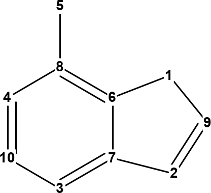
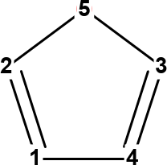
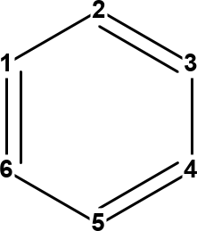

# Graph Properties

Graph theory is the most common representation in cheminformatics, and with
quantum mechanics, rule the informatics side of chemistry. The molecular graph
follow <a name="tp1">graph</a> theory and defines atoms as molecules and bonds as edge between to
atoms. This is by far the only option, and the IBond allows for more complex
representations, but we will focus on the molecular graph in this chapter.

<a name="sec:partitioning"></a>
## Partitioning

If one is going to calculate graph properties, the first thing one often has to
do, is to split ensure that one is looking at a fully connected graph. Since
this is often in combination with ensuring fully connected graphs, the
[`ConnectivityChecker`](http://cdk.github.io/cdk/latest/docs/api/org/openscience/cdk/graph/ConnectivityChecker.html) is a welcome tool. It allows
<a name="tp2">partitioning</a> of the
atoms and bonds in an [`IAtomContainer`](http://cdk.github.io/cdk/latest/docs/api/org/openscience/cdk/interfaces/IAtomContainer.html) into molecules, organized into
[`IAtomContainerSet`](http://cdk.github.io/cdk/latest/docs/api/org/openscience/cdk/interfaces/IAtomContainerSet.html):

**Script** [code/ConnectivityCheckerDemo.groovy](code/ConnectivityCheckerDemo.code.md)
```groovy
atomCon = new AtomContainer();
atom1 = new Atom("C");
atom2 = new Atom("C");
atomCon.addAtom(atom1);
atomCon.addAtom(atom2);
moleculeSet = ConnectivityChecker.partitionIntoMolecules(
  atomCon
);
println "Number of isolated graphs: " +
  moleculeSet.atomContainerCount
```

Which gives:

```plain
Number of isolated graphs: 2
```

<a name="sec:spanningtree"></a>
## Spanning Tree

The <a name="tp3">spanning tree</a> of a graph, is subgraph with no cycles; that spans
all atoms into a, still, fully connected graph:

**Script** [code/SpanningTreeBondCount.groovy](code/SpanningTreeBondCount.code.md)
```groovy
println "Number of azulene bonds: $azulene.bondCount"
treeBuilder = new SpanningTree(azulene)
azuleneTree = treeBuilder.getSpanningTree();
println "Number of tree bonds: $azuleneTree.bondCount"
```

which returns:

```plain
Number of azulene bonds: 11
Number of tree bonds: 9
```

As a side effect, it also determines which bonds are <a name="tp4">ring bonds</a>, and which are
not:

**Script** [code/SpanningTreeRingBonds.groovy](code/SpanningTreeRingBonds.code.md)
```groovy
ethaneTree = new SpanningTree(ethane)
println "[ethane]"
println "Number of cyclic bonds: " +
  ethaneTree.bondsCyclicCount
println "Number of acyclic bonds: " +
  ethaneTree.bondsAcyclicCount
azuleneTree = new SpanningTree(azulene)
println "[azulene]"
println "Number of cyclic bonds: " +
  azuleneTree.bondsCyclicCount
println "Number of acyclic bonds: " +
  azuleneTree.bondsAcyclicCount
```

giving

```plain
[ethane]
Number of cyclic bonds: 0
Number of acyclic bonds: 1
[azulene]
Number of cyclic bonds: 11
Number of acyclic bonds: 0
```

<a name="sec:ringsearch"></a>
## Ring counts

<b>Warning: this section needs updating as there are better approaches in CDK 2.x.</b>

Without providing a full review of all ring detection algorithms, this section discusses three
algorithms for <a name="tp5">ring detection</a>. The first two are alternative
implementations of the <a name="tp6">Smallest Set of Smallest Rings</a> (<a name="tp7">SSSR</a>) concept. While argued to have limited
usefulness if not harmful [<a href="#citeref1">1</a>], the CDK implements two algorithms: the
<a name="tp8">Figueras algorithm</a> [<a href="#citeref2">2</a>], and an improved algorithm addressing limitations of
the first [<a href="#citeref3">3</a>].
The key limitation is that the resulting set is not unique. Depending on the initial conditions,
alternative sets may result for the same structure, particularly for structures with bridgehead
atoms. However, on the bright side, it does give some indication on the number of rings in a structure.

The third algorithm discussed is one to find all rings, even if they are merely combinations of
smaller rings. For example, naphthalene contains has three rings.

### Smallest Rings

The smallest set of smallest rings refers to a set of unique <a name="tp9">rings</a> that, together, capture all
ring atoms. Ring atoms may participate in multiple rings in this set, but each ring will have
at least one ring atom not in other rings. But for each compound, the set itself may not be unique.
For example, adamantane has multiple SSSRs. The trick of the SSSR algorithm is to find a smallest
set of rings that cover all ring atoms.

The CDK implements two algorithms, both are found in the `cdk.ringsearch` package. The
first is the algorithm developed by Figureas [2] for which the
`FiguerasSSSRFinder` class can be used:

**Script** [code/FiguerasSSSR.groovy](code/FiguerasSSSR.code.md)
```groovy
ringset = new FiguerasSSSRFinder().findSSSR(azulene)
println "Number of rings: $ringset.atomContainerCount"
```

Which tells us the number of smallest rings for azulene:

```plain
Number of rings: 2
```

However, because of this algorithm's limitations in finding a correct SSSR set for some corner
case structure, the following alternative method by Berger \textit{et al.} [3] is
recommended:

**Script** [code/SSSR.groovy](code/SSSR.code.md)
```groovy
ringset = new SSSRFinder(azulene).findSSSR()
println "Number of rings: $ringset.atomContainerCount"
```

Which calculates the same number of rings for this compound:

```plain
Number of rings: 2
```

### All Rings

If you are interesting in all possible rings, you can use the [`AllRingsFinder`](http://cdk.github.io/cdk/latest/docs/api/org/openscience/cdk/ringsearch/AllRingsFinder.html) class, which
implements an algorithm by Hanser \textit{et al.} [<a href="#citeref4">4</a>]:

**Script** [code/FindAllRings.groovy](code/FindAllRings.code.md)
```groovy
ringset = new AllRingsFinder().findAllRings(azulene)
println "Number of rings: $ringset.atomContainerCount"
```

Which returns all three rings present in azulene:

**Script** [code/FindAllRings.groovy](code/FindAllRings.code.md)
```groovy
ringset = new AllRingsFinder().findAllRings(azulene)
println "Number of rings: $ringset.atomContainerCount"
```

One should keep in mind that when more smallest rings are fused together, the number of
all rings grows quickly. The [`AllRingsFinder`](http://cdk.github.io/cdk/latest/docs/api/org/openscience/cdk/ringsearch/AllRingsFinder.html) class has three options to keep the
calculation manageable for larger structures.

The first option is to search only for rings up to a certain size. For example, only rings
of at most 5 atoms:

**Script** [code/FindUptoFiveRings.groovy](code/FindUptoFiveRings.code.md)
```groovy
ringset = new AllRingsFinder().findAllRings(azulene, 5)
println "Number of rings: $ringset.atomContainerCount"
```

For which there is only one in azulene:

```plain
Number of rings: 1
```

A second option is more like a trick to reduce the search space, but first isolating
the ring systems. There are `findAllRingsInIsolatedRingSystem` alternatives for the
above two approaches.

The third option to limit the execution time is to set a time out. This ensures that
a computation will return after a certain time rather than continuing indefinately:

**Script** [code/FindAllRingsInLimitedTime.groovy](code/FindAllRingsInLimitedTime.code.md)
```groovy
ringFinder = new AllRingsFinder()
ringFinder.setTimeout(1000) // one second
ringset = new AllRingsFinder().findAllRings(azulene)
```

## Graph matrices

Chemical graphs have been very successfully used as representations of molecular
structures, but are not always to most suitable representation. For example,
for computation of graph properties often a matrix representation is used
as intermediate step. The CDK has predefined helper classes to calculate two
kind of <a name="tp10">graph matrices</a>: the adjacency matrix and the distance matrix. Both
are found in the `cdk.graph.matrix` package.

### Adjacency matrix

The <a name="tp11">adjacency matrix</a> describes which atoms are connected via a covalent
bond. All matrix elements that link to bonded atoms are 1, and those matrix
elements for disconnected atoms are 0. In mathematical terms, the adjacency matrix `A` is defined as:

<b>Copy back in the equation. MathML?</b>

The algorithm to calculate this matrix is implemented in the
[`AdjacencyMatrix`](http://cdk.github.io/cdk/latest/docs/api/org/openscience/cdk/graph/matrix/AdjacencyMatrix.html) class. The matrix is calculated with
the static `getMatrix(IAtomContainer)` method:

**Script** [code/AdjacencyMatrixCalc.groovy](code/AdjacencyMatrixCalc.code.md)
```groovy
int[][] matrix = AdjacencyMatrix.getMatrix(ethanoicAcid)
for (row=0;row<ethanoicAcid.getAtomCount();row++) {
  for (col=0;col<ethanoicAcid.getAtomCount();col++) {
    print matrix[row][col] + " "
  }
  println ""
}
```

This code outputs the matrix, resulting for ethanoic acid, with the
atoms in the order C, C, O, and O, in:

```plain
0 1 0 0 
1 0 1 1 
0 1 0 0 
0 1 0 0 
```

### Distance matrix

The distance matrix describes the number of bonds on has to traverse
to get from one atom to another. Therefore, it has zeros on the diagonal
and non-zero values at all other locations. Matrix elements for
neighboring atoms are 1 and others are larger. The CDK uses
<a name="tp12">Floyd's algorithm</a> to calculate this matrix [<a href="#citeref5">5</a>],
which is exposed via the [`TopologicalMatrix`](http://cdk.github.io/cdk/latest/docs/api/org/openscience/cdk/graph/matrix/TopologicalMatrix.html) class:

**Script** [code/DistanceMatrix.groovy](code/DistanceMatrix.code.md)
```groovy
int[][] matrix = TopologicalMatrix.getMatrix(ethanoicAcid)
```

For the ethanoic acid used earlier, the resulting matrix looks like:

```plain
0 1 2 2 
1 0 1 1 
2 1 0 2 
2 1 2 0 
```

## Atom Numbers

Another important aspect of the chemical graph, is that the graph uniquely
places atoms in the molecule. That is, the graphs allows us to uniquely
identify, and therefore, number atoms in the molecule. This is an important
aspect of cheminformatics, and the concept behind <a name="tp13">canonicalization</a>, such
as used to create <a name="tp14">canonical SMILES</a>. The InChI library (see Chapter [18](inchi.md#sec:inchi))
implements such an algorithm, and we can use it to assign unique integers to all
atoms in a chemical graph.

### Morgan Atom Numbers

Morgan published an algorithm in 1965 to assign numbers <!-- <a name="tp15">Morgan atom numbers</a> -->
to vertices in the chemical graph [<a href="#citeref6">6</a>].
The algorithm does not take into account the element symbols
associated with those vertices, and it only based on the connectivity.
Therefore, we see the same number of symmetry related atoms, even if they have
different symbols. If we run:

**Script** [code/MorganAtomNumbers.groovy](code/MorganAtomNumbers.code.md)
```groovy
oxazole = MoleculeFactory.makeOxazole();
long[] morganNumbers =
  MorganNumbersTools.getMorganNumbers(
    oxazole
  );
for (i in 0..(oxazole.atomCount-1)) {
  println oxazole.getAtom(i).symbol +
    " " + morganNumbers[i]
}
```

we see this output:

```plain
C 64
O 64
C 64
N 64
C 64
```

<a name="sec:inchiatomnumbers"></a>
### InChI Atom Numbers

<a name="fig:inchiAtomNumbers"></a>
  
<br />**Figure 13.1**: InChI atom numbers of adenine (left), oxazole (middle), and benzene (right).

The <a name="tp16">InChI</a> library does not have a direct method to calculate atom numbers
from Java, but the CDK can extract these from the auxiliary layer. These numbers
are those listed in the bond layer, but to use these in the CDK molecule class,
we need to mapping of the <a name="tp17">InChI atom numbers</a> This method
is made available via the [`InChINumbersTools`](http://cdk.github.io/cdk/latest/docs/api/org/openscience/cdk/graph/invariant/InChINumbersTools.html) class:

**Script** [code/InChIAtomNumbers.groovy](code/InChIAtomNumbers.code.md)
```groovy
oxazole = MoleculeFactory.makeOxazole();
long[] morganNumbers =
  InChINumbersTools.getNumbers(
    oxazole
  );
for (i in 0..(oxazole.atomCount-1)) {
  atom = oxazole.getAtom(i)
  println atom.symbol +
    " " + morganNumbers[i]
}
```

which outputs:

```plain
C 2
O 5
C 3
N 4
C 1
```

It is important to note that because these numbers are used in the connectivity layer,
symmetry is broken in assignment of these numbers, allowing all atoms in, for example,
benzene to still be uniquely identified:

**Script** [code/InChIAtomNumbersBenzene.groovy](code/InChIAtomNumbersBenzene.code.md)
```groovy
benzene = MoleculeFactory.makeBenzene();
long[] numbers =
  InChINumbersTools.getNumbers(
    benzene
  );
for (i in 0..(benzene.atomCount-1)) {
  atom = benzene.getAtom(i)
  atom.setProperty(
    "AtomNumber",
    "" + numbers[i]
  )
}
```

which outputs:

```plain
C 1
C 2
C 4
C 6
C 5
C 3
```

The InChI atom numbers are shown in Figure ??.

## References

1. <a name="citeref1"></a>OpenEye, Smallest Set of Smallest Rings (SSSR) Considered Harmful, [http://www.eyesopen.com/docs/toolkits/current/html/OEChem\_TK-python/ring.html\#smallest-set-of-smallest-rings-sssr-considered-harmful](http://www.eyesopen.com/docs/toolkits/current/html/OEChem\_TK-python/ring.html\#smallest-set-of-smallest-rings-sssr-considered-harmful)
2. <a name="citeref2"></a>Figueras J. Ring Perception Using Breadth-First Search. Journal of Chemical Information and Modeling. 1996 Jan 1;36(5):986–91.  doi:[10.1021/CI960013P](https://doi.org/10.1021/CI960013P)
3. <a name="citeref3"></a>Berger F, Gritzmann P, de Vries S. Minimum Cycle Bases for Network Graphs. Algorithmica. 2004 May 28;40(1):51–62.  doi:[10.1007/S00453-004-1098-X](https://doi.org/10.1007/S00453-004-1098-X)
4. <a name="citeref4"></a>Hanser Th, Jauffret Ph, Kaufmann G. A New Algorithm for Exhaustive Ring Perception in a Molecular Graph. Journal of Chemical Information and Modeling. 1996 Jan 1;36(6):1146–52.  doi:[10.1021/CI960322F](https://doi.org/10.1021/CI960322F)
5. <a name="citeref5"></a>Floyd RW. Algorithm 97: Shortest path. Communications of the ACM. 1962 Jun 1;5(6):345.  doi:[10.1145/367766.368168](https://doi.org/10.1145/367766.368168)
6. <a name="citeref6"></a>Morgan HL. The Generation of a Unique Machine Description for Chemical Structures-A Technique Developed at Chemical Abstracts Service. Journal of Chemical Documentation. 1965 Jan 1;5(2):107–13.  doi:[10.1021/C160017A018](https://doi.org/10.1021/C160017A018)


