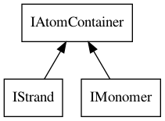

# Protein and DNA

While the most prominent functionality of the CDK lies around small organic molecules,
there is support for protein structures too. Of course, <topic>protein</topic> are just large
organic molecules, and the <class>IAtomContainer</class> can simply be used. The same holds
for <topic>DNA</topic> strands. However, there is more extensive support for protein and
DNA in the CDK, and this chapter will outline some of that.
The core interface is the <class>IBioPolymer</class> interface, which is derived from an
IAtomContainer. Figure XX shows its hierarchy.

  
Figure XX: The <class>IBioPolymer</class> interface extends the <class>IPolymer</class> interface,
which extends the <class>IAtomContainer</class> interface.

## Protein From File

One straightforward way to create protein and DNA structures is to read them from
PDB files [<cite>Q24650571</cite>]. Chapter XX explains how files are read in general. For <topic>PDB files</topic>,
the <class>PDBReader</class> should be used. A code example showing how to use this reader
is given by Script XX.

Of course, we can also read PDB files from a local disc. The results are read into
a <class>IChemFile</class>. from which the first IAtomContainer is the IBioPolymer. For example,
we can read <topic>crambin</topic> [<cite>Q34206190</cite>]:

<code>ProteinFromFile</code>

Which returns:

<out>ProteinFromFile</out>

## Protein From Sequence

It is also possible to create an protein data structure starting from a <topic>sequence</topic>
with the <class>ProteinBuilder</class> class:

<code>ProteinFromSequence</code>

Because a IBioPolymer extends the IAtomContainer interface, we can simply query for
the number of atoms, as done here. The scripts returns us:

<out>ProteinFromSequence</out>

## Strands and Monomers

The <class>IBioPolymer</class> interface is modeled after PDB files, those being their primary
use case. Therefore, the data structure can hold atoms part of proteins, hetero atoms,
solvents, etc. The atoms in the protein structure itself, are also part of a monomer,
but also of strands, which consist of a sequence of polymers. So, a BioPolymer is not a single polymeric molecule.

There are access methods for the strand information we can use to iterate over the sequence of a biopolymer:

<code>ProteinStrands</code>

This returns a list of strands and the number of atoms per strand.

<out>ProteinStrands</out>

Each strand consists of a sequence monomers, over which we can iterate:

<code>ProteinMonomers</code>

The full script has some hidden code to only list the first few monomers:

<out>ProteinMonomers</out>

The <class>IStrand</class> and <class>IMonomer</class> interfaces provide functionality to access
specific properties, but also extend the `IAtomContainer` interface, as depicted
in Figure XX. Both provide access to a name for the entity as
well as a type:

<code>BioNameType</code>

Using these methods, we get some additional information about the strands and monomers:

<out>BioNameType</out>

  
Figure XX: The <class>IStrand</class> and <class>IMonomer</class> interfaces extend the
<class>IAtomContainer</class> interface.

## References

<references/>

