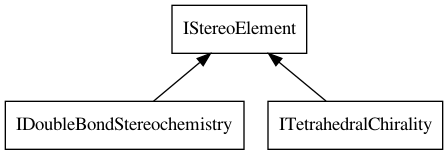

<section level="#" label="stereo">Stereochemistry</section>

An intrinsic property of molecular structures is the 3D organization of the atoms,
resulting in a unique <topic type="key">geometry</topic>. If we change the position of an atom, we get a
different geometry. We can lengthen and shorten a bond; change the angle
between two bonds; and rotate around bonds, changing torsion angles in
the molecules. All these changes lead to different <topic>conformations</topic> of the structure.

However, when we starting switching two atoms, or two atom groups, then we are
no longer talking about conformations, but about stereoisomers. Stereoisomers share
the same chemical graph, but no matter what combinations of bond and torsion changes,
we cannot <topic>superimpose</topic> the two molecules on top of each other.

There are many kinds of geometrical constructs giving rise to stereochemistry.
What they share, is that they are properties of the molecules, even though we
are used to associate them with an atom or a bond. This is particularly the
case for the two most common sources of stereochemistry: tetrahedral chirality,
and double bond stereochemistry.

<section level="##" label="stereo:bond">Stereochemistry in a flat world</section>

Two dimensions drawings allow for depicting of three dimensional stereochemistry.
It is not good at that, particular using <topic>wedge bonds</topic>, as us chemists typically
do. In fact, there are so many ways it can go wrongs that a long list of guidelines
have been developed [<cite>Q54062338</cite>].

The CDK has supported wedge bond stereo for a very long time, with its origin
in the JChemPaint. An example 2D depiction is that of bromochlorofluoroiodomethane
is shown in Figure <xref>wedgebond</xref>.

<figure label="wedgebond" caption="2D depictions can reflect stereochemistry using wedge bonds.">

</figure>

To add such 2D stereochemistry information we use the `IBond.setStereo()`
method:

<code>StereoisomerOne</code>

This `setStereo()` and `getStereo()` methods in `IBond` take
and `IBond.Stereo` class. The values are defined by the matching enumeration
and can be iterated over and printed with:

<code>BondStereos</code>

That gives a fairly long list. Keep in mind that a bond is directed: a bond
has a first and second atom. That is the reason why an `UP` bond is
directed too. The thicker wedge side is at the side of the second atom.
If you like to *invert* that wedge bond, you use the `UP_INVERTED`
version.

But if we look at the full list, we also see that `IBond.Stereo` also
allows the specification of double bond stereochemistry:

<out>BondStereos</out>

However, nowadays the CDK also has other means to specify stereochemistry
that is independent from 2D depictions, and those our outlined in the next
sections.

## Tetrahedral chirality

The <topic>tetrahedral chirality</topic> describes the geometry around four-coordinate
atoms. For example, consider methane. It has five atoms, connected with
four bonds. For the 3D geometry, a four-coordinate carbon gives a tetrahedral
structure with the four atoms connected to the atoms at the four corners and a
carbon right in the middle. Note that we can two switch hydrogen atoms, but that
would not make any difference.

<figure label="mirrorImages" caption="Stereoisomers of bromochlorofluoroiodomethane.">

</figure>
%%% <code>StereoisomerOne</code>
%%% <code>StereoisomerTwo</code>

If we replace two hydrogens with a chloride and a bromide, we can still switch
the two hydrogen atoms, and still have the same geometry. If we switch the two
halogens from place, the structure depiction will change at first, but we would
quickly notice that if we rotate one of the two structures, we still have the
same structure.

The interesting turning point is when you replace the third hydrogen with yet
another halogen. Now we have four different atoms surrounding the central atom.
There is just a single chemical graph, with five atoms, connected with
four bonds. For the 3D geometry, a four-coordinate carbon gives a tetrahedral
structure with the four atoms connected to the atoms at the four corners and a
carbon right in the middle.

With this geometry we no longer can switch two atoms bound to the carbon without
changing the geometry: switching two halogens causes the stereochemistry to
change. In fact, there are two possible stereoisomers, each of which is a mirror
image of the other, as depicted in Figure <xref>mirrorImages</xref>.

Because wedge bonds are ambiguous and only work for systems with specified
2D coordinates, a data model has been set up that is independent from coordinate
systems. The base interface is `IStereoElement` from which specific
stereo elements derive. This is depicted in Figure <xref>stereoInheritance</xref>.

<figure label="stereoInheritance" caption="The `ITetrahedralChirality` and `IDoubleBondStereochemistry` interfaces extends the `IStereoElement` interface.">

</figure>

The `ITetrahedralChirality` interface requires you to specify the four neighboring
atoms around a central <topic>chiral atom</topic>. Thus for bromochlorofluoroiodomethane
we can define the chirality also without coordinates. For this, we use the
constructor of the interface's prime implementation:

<code>TetrahedralStereo</code>

The interface provides appropriate getter methods for algorithms to use:

<code>TetrahedralIface</code>

Which reports:

<out>TetrahedralIface</out>

Mind you, the `Stereo` class listed here is different from that for IBonds.
`ITetrahedralChirality.Stereo` has only two values, which we print like any
enumeration with:

<code>ChiralityStereos</code>

Which shows that following seen from the first ligand atom, in order of the
remaining three ligand atoms, they following a <topic>clockwise</topic> or
<topic>anti-clockwise</topic> circle:

<out>ChiralityStereos</out>

## References

<references/>

